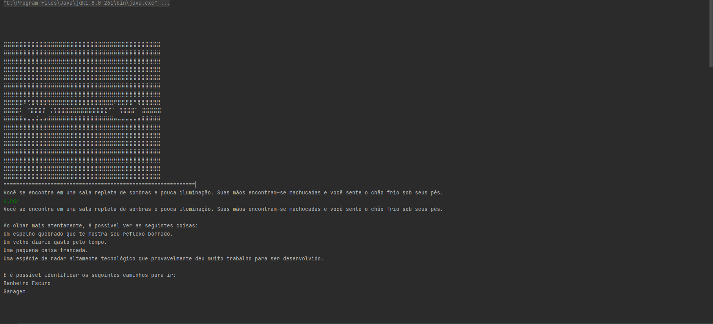
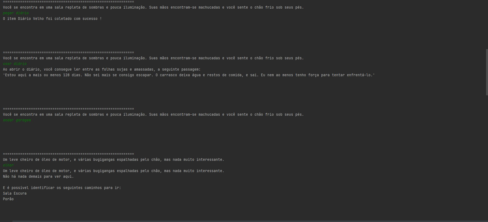
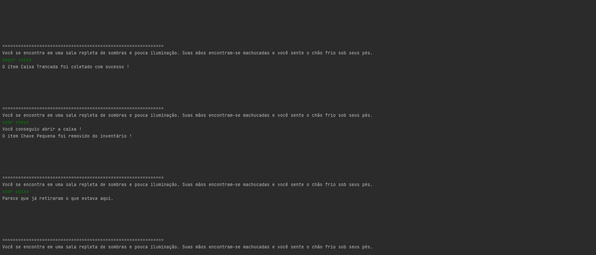

# Text Adventure Game

**Número da Lista**: -
**Conteúdo da Disciplina**: Grafos 1

## Alunos
|Matrícula | Aluno |
| -- | -- |
| 14/0133305  |  Caio Felipe Dias Nunes |
| 15/0016018  |  Lucas Oliveira Silva |

## Sobre 
Um framework para desenvolvimento de jogos no estilo RPG de texto, todo baseado em grafos, onde é possível desenvolver diversos jogos diferentes utilizando uma hierarquia simples. 

## Screenshots

## Instalação 
**Linguagem**: Java
**Framework**: -  

**Pré-Requisitos**: 
JDK 8.0 ou Superior

## Uso 
O projeto trata-se de uma API de desenvolvimento de jogos em texto, onde apenas utilizando herança de algumas classes chave, é possível implementar um jogo completo, além de adicionar suas próprias particularidades.

Para começar a usar, tente dar uma olhada nas seguintes classes:

1. **ItemDesbloqueavel:** Classe que representa itens que necessitam de outros para serem destravados. Um baú, uma porta trancada, uma caixa de ferramentas lacrada, etc.
2. **ItemConsumível:** Classe que representa um item que possua cargas de uso, e após o término das cargas, será destruído. Uma poção de cura, uma garrafa de água, etc.
3. **ItemChave:** Classe que representa itens que são usados para desbloquear outros itens. Uma chave de uma porta, um alicate para quebrar cadeados, etc.
4. **ItemLegivel:** Classe que representa itens que possuem textos específicios. Livros, diários, cadernos, etc.
5. **Area:** Classe que representa uma area do seu mapa de jogo. Você pode extender essa classe para criar áreas com propriedades diferentes.

Para desenvolver seu jogo, você precisa criar Areas e adicioná-las ao mapa através do objeto **JogoController**. Este retorna um singleton do seu jogo, onde estarão armazenados os dados importantes. Você pode adicionar Itens a essas áreas, e conectá-las utilizando os métodos padrão da JogoController. Alguns métodos úteis:

1.**addArea().**   
2.**addItem().**   
3.**conectarArea().**   
4.**listarAreasJogo().**   
5.**imprimeMapaJogo().**   

As informações do jogador também podem ser acessadas pelo objeto **JogoController**, então não esqueça de dar uma olhada profunda nesta classe.

Também é interessante se aprofundar na classe **"InterpreteJogador"**. Ela é uma classe responsável por reconhecer comandos de terminal e reproduzir as ações correspondentes, através de chamadas polimórficas a métodos das classes pai (Item, Area, Personagem). As ações possíveis até o momento são:

1.**olhar.**   
2.**pegar.**   
3.**andar.**   
4.**usar.**   
5.**ler.**   

Caso deseje adicionar novas ações aos seus jogadores, apenas adicione um novo elemento ao Enum **"Acao"**, o seu correspondente tipo no enum **"TipoAcao"**, e a respectiva ação a ser executada no método **"agir"** dentro da classe **"InterpreteJogador"**.

Há um pequeno exemplo de utilização dessa API na classe **"Principal"**. Dê uma olhada, caso queira ter uma ideia do que é possível fazer e por onde começar.
